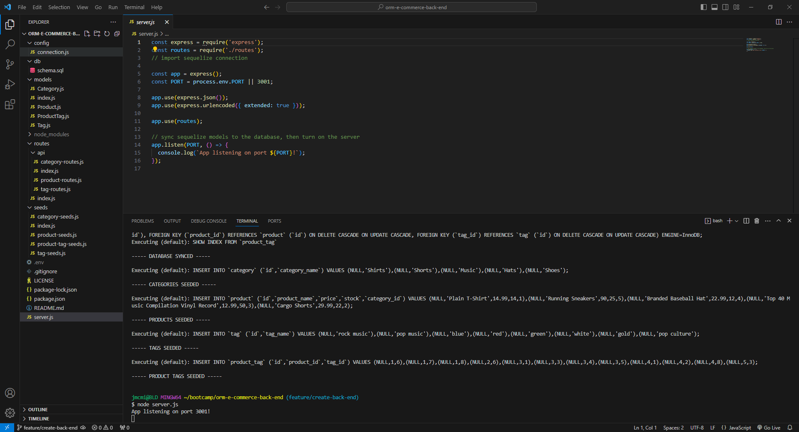
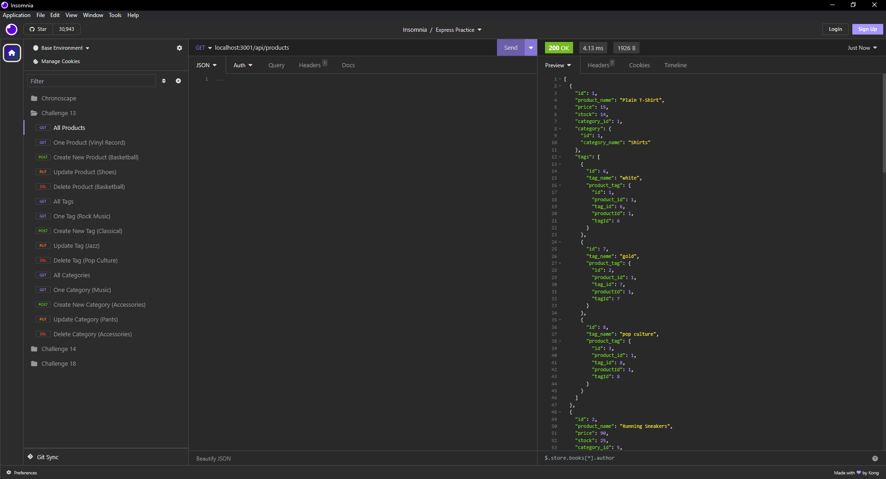

# ORM-E-Commerce-Back-End

## Description

As a web developer, it's important that I understand how API routes work on the back end of a project when it comes to creating, reading, updating, and deleting data. Since E-commerce is a rather huge industry, I figured that I would showcase my understanding of back-end API routes by putting together an E-commerce back-end that does exactly that.

## Installation

To access the E-Commerce Back-End, you'll need to clone the repo at the link below:
https://github.com/jmcmillenmusic/orm-e-commerce-back-end
You'll need to make sure that you also have DotENV, Sequelize, the MySQL Node package, and Express by running the following commands in the terminal:
`npm i dotenv`
`npm i sequelize`
`npm i mysql`
`npm i express`
Then, you'll need to initialize all of these using the following command in the terminal:
`npm init`
You'll need to access a back-end routing program like Insomnia to test the routes, which you can get at https://insomnia.rest/.

## Usage

To access the database and manipulate its data, open the terminal from `server.js` and run the following command in the terminal:
`mysql -u root -p`
Once you enter your password, you'll be logged in.
Run this command in the terminal to set up the database:
`SOURCE db/schema.sql;`
Then, type `quit` to close MySQL.
Then, run this command in the terminal to seed the database:
`node seeds/index.js`
Then, run this command to start the server:
`node server.js`
From there, you can run your routes in Insomnia in order to see all of the Create, Read, Update, and Delete functions.
You can watch this video to see the E-commerce back-end in action:
https://drive.google.com/file/d/1bMyKwr81L5aw-iZ_WQa4Se1jPRnwy48R/view

## Credits

N/A

## License

This project uses the MIT License.